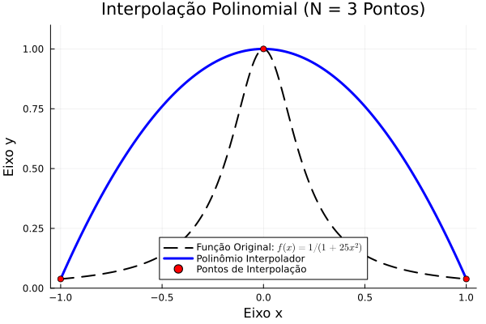

# Cálculo Numérico com Julia

**Repositório dedicado aos estudos, códigos e implementações da disciplina de Cálculo Numérico, utilizando a linguagem de programação Julia.**

---

---

## Sobre a Disciplina

Este repositório serve como um caderno de anotações interativo, contendo implementações dos principais métodos estudados em sala de aula, com ênfase na eficiência e na sintaxe limpa que a linguagem **Julia** proporciona.

## Agradecimento ao Professor

Este material foi desenvolvido com base nas aulas ministradas pelo **Dr. BRUNO FRANCISCO XAVIER**. Seu material didático e exemplos foram a base para a criação e organização destes códigos.

---

## Estrutura do Repositório

O repositório está organizado para separar os arquivos de código (`.jl`) e os arquivos de demonstração (`.gif`):